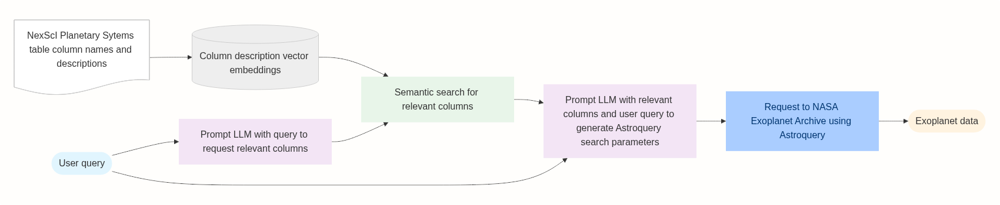

# ExoQuery
Natural language interface for querying the NASA Exoplanet Archive.



#### Example: "What are the smallest exoplanets with an orbital period less than one day?"

Generated column search queries:
```json
{
    'column_requests': [
        'planetary radius or mass (to determine size/smallest planets)',
        'orbital period of the planet'
    ]
}
```

Column results from embedding retrievals:
```csv
pl_radj,Planet Radius [Jupiter Radius],"Radius of the planet, measured in units of radius of Jupiter"'
'pl_rade,Planet Radius [Earth Radius],"Radius of the planet, measured in units of radius of the Earth"
pl_orbper,Orbital Period [days],Time the planet takes to make a complete orbit around the host star or system
```

Constructed `NasaExoplanetArchive.query_criteria` parameters:
```json
{
  "select": "pl_name, pl_rade, pl_orbper",
  "where": "pl_orbper < 1 AND pl_rade IS NOT NULL",
  "order": "pl_rade ASC"
}
```

Results from the archive:
```csv
pl_name,pl_rade,pl_orbper
Kepler-879 c,0.4,0.646716
KOI-4777.01,0.42,0.824000125
KOI-4777.01,0.42,0.824000125
KOI-4777.01,0.42,0.824000125
Kepler-158 d,0.43,0.645088
KOI-4777.01,0.51,0.412
Kepler-1489 c,0.51,0.680741
...
```
